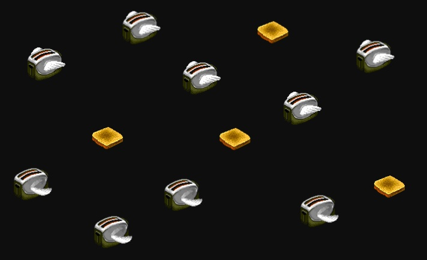

# After Dark in CSS

Do you longingly reminisce about the days when flying toasters graced your screen? Do words like "Confetti Factory" and "Daredevil Dan" make your heart skip a beat?

If so, then never fear—CSS is here! Using modern CSS techniques like animations and transforms, we can imitate several of your favorite After Dark™ screensavers.

The animations were made with CSS alone. No animated gifs or JavaScript.

### [See them here!](http://bryanbraun.github.io/after-dark-css/)

#### Why?

Just for fun.

#### Thanks to:

[Jonathon Sampson](https://twitter.com/jonathansampson), [Keith Clark](http://codepen.io/keithclark/), [Rob Glazebrook](http://www.cssnewbie.com/pure-css-bouncing-ball), [Ryan Justice](http://ned.highline.edu/~ryan-j/200/final/) and others for posting tutorials & demos on CSS animations.
[N. Landsteiner](http://www.masswerk.at/flyer/), [David Donarumo](http://www.youtube.com/watch?v=M1w1SQ3ezh8), and [Lazy Game Reviews](http://www.youtube.com/watch?v=ANnYbX54oU4) for online preservation of what the original screensavers looked like.
Robin Casady for the Public Domain [ChicagoFLF](http://christtrekker.users.sourceforge.net/fnt/chicago.shtml) font.
The original screensavers and artwork are © 1989 Berkeley Systems Inc.
